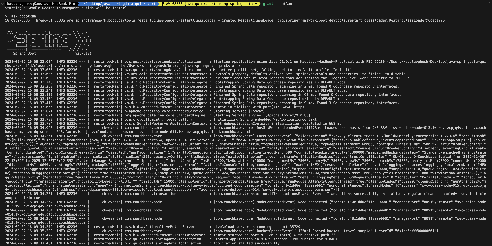
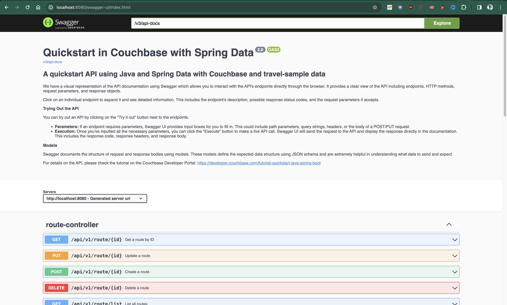

# Quickstart in Couchbase with Spring Data and Java

#### REST API using Couchbase Capella in Java using Spring Data

Often, the first step developers take after creating their database is to create a REST API that can perform Create, Read, Update, and Delete (CRUD) operations for that database. This repo is designed to teach you and give you a starter project (in Java using Spring Data) to generate such a REST API. After you have installed the travel-sample bucket in your database, you can run this application which is a REST API with Swagger documentation so that you can learn:

1. How to create, read, update, and delete documents using Key-Value[ operations](https://docs.couchbase.com/java-sdk/current/howtos/kv-operations.html) (KV operations). KV operations are unique to Couchbase and provide super fast (think microseconds) queries.
2. How to write simple parameterized [SQL++ Queries](https://docs.couchbase.com/java-sdk/current/howtos/n1ql-queries-with-sdk.html) using the built-in travel-sample bucket.

Full documentation for the tutorial can be found on the [Couchbase Developer Portal](https://developer.couchbase.com/tutorial-quickstart-spring-data-java/).

This example uses spring data, however, if you are looking for springboot sample app please go to this [repository](https://github.com/couchbase-examples/java-springboot-quickstart).

## Prerequisites

To run this prebuilt project, you will need:

- [Couchbase Capella](https://www.couchbase.com/products/capella/) cluster with [travel-sample](https://docs.couchbase.com/java-sdk/current/ref/travel-app-data-model.html) bucket loaded.
  - To run this tutorial using a self-managed Couchbase cluster, please refer to the [appendix](#running-self-managed-couchbase-cluster).
- [Java 17 or higher](https://www.oracle.com/in/java/technologies/downloads/#java17)
  - **Java 17+ is required** for Gradle 9.0+ compatibility
  - Ensure that the Java version is compatible with the Couchbase SDK
- [Loading Travel Sample Bucket](https://docs.couchbase.com/cloud/clusters/data-service/import-data-documents.html#import-sample-data)
  - If `travel-sample` is not loaded in your Capella cluster, you can load it by following the instructions for your Capella Cluster
- [Gradle 9.0 or higher](https://gradle.org/releases/)
  - The project uses Gradle wrapper, so manual installation is optional

## App Setup

We will walk through the different steps required to get the application running.

### Cloning Repo

```shell
git clone https://github.com/couchbase-examples/java-springdata-quickstart.git
```

### Install Dependencies

The dependencies for the application are specified in the `build.gradle` file in the source folder. Dependencies can be installed through `gradle` the default package manager for Java.

```
./gradlew build -x test
```

Note: The `-x test` option is used to skip the tests. The tests require the application to be running.

Note: The application is tested with Java 17. If you are using a different version of Java, please update the `build.gradle` file accordingly.

### Setup Database Configuration

To learn more about connecting to your Capella cluster, please follow the [instructions](https://docs.couchbase.com/cloud/get-started/connect.html).

Specifically, you need to do the following:

- Create the [database credentials](https://docs.couchbase.com/cloud/clusters/manage-database-users.html) to access the travel-sample bucket (Read and Write) used in the application.
- [Allow access](https://docs.couchbase.com/cloud/clusters/allow-ip-address.html) to the Cluster from the IP on which the application is running.

All configuration for communication with the database is read from environment variables. This quickstart provides two convenient ways to set up your database connection:

### Option 1: Environment Variables (Recommended for Production)

Set the environment variables directly in your environment:

```sh
export DB_CONN_STR=couchbases://<cluster-url>
export DB_USERNAME=your-username
export DB_PASSWORD=your-password
```

### Option 2: .env File (Recommended for Local Development)

Create a `.env` file in the project root directory:

```env
# Copy from .env.example and update with your actual values
DB_CONN_STR=couchbases://your-cluster-url.cloud.couchbase.com
DB_USERNAME=your-username
DB_PASSWORD=your-password
```

The `application.properties` file uses these environment variables with modern Spring Boot 3.5+ properties:

```properties
# Server configuration
server.forward-headers-strategy=framework

# Modern Couchbase configuration (Spring Boot 3.5+)
spring.couchbase.connection-string=${DB_CONN_STR}
spring.couchbase.username=${DB_USERNAME}
spring.couchbase.password=${DB_PASSWORD}

# Couchbase connection optimizations
spring.couchbase.env.timeouts.query=30000ms
spring.couchbase.env.timeouts.key-value=5000ms
spring.couchbase.env.timeouts.connect=10000ms
```

The application automatically loads environment variables from the `.env` file for local development convenience.

> Note: The connection string expects the `couchbases://` or `couchbase://` part.

## Cluster Connection Configuration

You do not need to make any changes to your configuration for this quickstart. However, read this section if you want to learn more about how Spring Data Couchbase connector can be configured by providing a `@Configuration` [bean](https://docs.spring.io/spring-framework/docs/current/reference/html/core.html#beans-definition) that extends [`AbstractCouchbaseConfiguration`](https://docs.spring.io/spring-data/couchbase/docs/current/api/org/springframework/data/couchbase/config/AbstractCouchbaseConfiguration.html).

```java
@Slf4j
@Configuration
@EnableCouchbaseRepositories
public class CouchbaseConfiguration extends AbstractCouchbaseConfiguration {

  @Value("#{systemEnvironment['DB_CONN_STR'] ?: '${spring.couchbase.connection-string:localhost}'}")
  private String host;

  @Value("#{systemEnvironment['DB_USERNAME'] ?: '${spring.couchbase.username:Administrator}'}")
  private String username;

  @Value("#{systemEnvironment['DB_PASSWORD'] ?: '${spring.couchbase.password:password}'}")
  private String password;

  // Since bucket auto-configuration is removed in modern Spring Boot, we hardcode the bucket name
  private String bucketName = "travel-sample";

  @Override
  public String getConnectionString() {
    return host;
  }

  @Override
  public String getUserName() {
    return username;
  }

  @Override
  public String getPassword() {
    return password;
  }

  @Override
  public String getBucketName() {
    return bucketName;
  }

  @Override
  public String typeKey() {
    return "type";
  }

  @Override
  @Bean(destroyMethod = "disconnect")
  public Cluster couchbaseCluster(ClusterEnvironment couchbaseClusterEnvironment) {
    try {
      log.debug("Connecting to Couchbase cluster at " + host);
      return Cluster.connect(getConnectionString(), getUserName(), getPassword());
    } catch (Exception e) {
      log.error("Error connecting to Couchbase cluster", e);
      throw e;
    }
  }

  @Bean
  public Bucket getCouchbaseBucket(Cluster cluster) {
    try {
      if (!cluster.buckets().getAllBuckets().containsKey(getBucketName())) {
        log.error("Bucket with name {} does not exist. Creating it now", getBucketName());
        throw new BucketNotFoundException(bucketName);
      }
      return cluster.bucket(getBucketName());
    } catch (Exception e) {
      log.error("Error getting bucket", e);
      throw e;
    }
  }

}
```

> _from config/CouchbaseConfiguration.java_

This configuration uses modern Spring Boot 3.5+ properties and automatically loads environment variables from `.env` files for local development. The configuration assumes you have either a locally running Couchbase server or a Couchbase Capella cluster.

Applications deployed to production or staging environments should use less privileged credentials created using [Role-Based Access Control](https://docs.couchbase.com/go-sdk/current/concept-docs/rbac.html).
Please refer to [Managing Connections using the Java SDK with Couchbase Server](https://docs.couchbase.com/java-sdk/current/howtos/managing-connections.html) for more information on Capella and local cluster connections.

## Running The Application

### Directly on Machine

At this point, we have installed the dependencies, loaded the travel-sample data and configured the application with the credentials. The application is now ready and you can run it.

```sh
./gradlew bootRun
```

Note: If you're using Windows, you can run the application using the Gradle wrapper batch file.

```sh
./gradlew.bat bootRun
```

### Using Docker

Build the Docker image

```sh
docker build -t java-springdata-quickstart .
```

Run the Docker image

```sh
docker run -d --name springdata-container -p 8080:8080 \
  -e DB_CONN_STR=couchbases://your-cluster-url.cloud.couchbase.com \
  -e DB_USERNAME=your-username \
  -e DB_PASSWORD=your-password \
  java-springdata-quickstart
```

Note: Pass your database credentials as environment variables to the Docker container. The `.env` file is used only for local development and won't be available in Docker containers.

### Verifying the Application

Once the application starts, you can see the details of the application on the logs.



The application will run on port 8080 of your local machine (http://localhost:8080). You will find the interactive Swagger documentation of the API if you go to the URL in your browser. Swagger documentation is used in this demo to showcase the different API endpoints and how they can be invoked. More details on the Swagger documentation can be found in the [appendix](#swagger-documentation).



## Running Tests

To run the integration tests, use the following commands:

```sh
./gradlew test
```

Note: The tests include comprehensive integration tests that connect to your Couchbase cluster and validate all CRUD operations with clean logging output.

## Appendix

### Data Model

For this quickstart, we use three collections, `airport`, `airline` and `routes` that contain sample airports, airlines and airline routes respectively. The routes collection connects the airports and airlines as seen in the figure below. We use these connections in the quickstart to generate airports that are directly connected and airlines connecting to a destination airport. Note that these are just examples to highlight how you can use SQL++ queries to join the collections.


### Extending API by Adding New Entity

If you would like to add another entity to the APIs, these are the steps to follow:

- You can create the collection using the [SDK](https://docs.couchbase.com/sdk-api/couchbase-java-client-3.5.2/com/couchbase/client/java/Collection.html#createScope-java.lang.String-) or via the [Couchbase Server interface](https://docs.couchbase.com/cloud/n1ql/n1ql-language-reference/createcollection.html).
- Create a new entity class in the `models` package similar to the existing entity classes like `Airport.java`.
- Define the controller in a new file in the `controllers` folder similar to the existing classes like `AirportController.java`.
- Define the service in a new file in the `services` folder similar to the existing classes like `AirportService.java`.
- Define the repository in a new file in the `repositories` folder similar to the existing classes like `AirportRepository.java`.

### Running Self-Managed Couchbase Cluster

If you are running this quickstart with a self-managed Couchbase cluster, you need to [load](https://docs.couchbase.com/server/current/manage/manage-settings/install-sample-buckets.html) the travel-sample data bucket in your cluster and generate the credentials for the bucket.

You need to update the connection string and the credentials in the `application.properties` file in the `src/main/resources` folder.

Note: Couchbase Server version 7 or higher must be installed and running before running the Spring Boot Java app.

### Swagger Documentation

Swagger documentation provides a clear view of the API including endpoints, HTTP methods, request parameters, and response objects.

Click on an individual endpoint to expand it and see detailed information. This includes the endpoint's description, possible response status codes, and the request parameters it accepts.

#### Trying Out the API

You can try out an API by clicking on the "Try it out" button next to the endpoints.

- Parameters: If an endpoint requires parameters, Swagger UI provides input boxes for you to fill in. This could include path parameters, query strings, headers, or the body of a POST/PUT request.

- Execution: Once you've inputted all the necessary parameters, you can click the "Execute" button to make a live API call. Swagger UI will send the request to the API and display the response directly in the documentation. This includes the response code, response headers, and response body.

#### Models

Swagger documents the structure of request and response bodies using models. These models define the expected data structure using JSON schema and are extremely helpful in understanding what data to send and expect.
